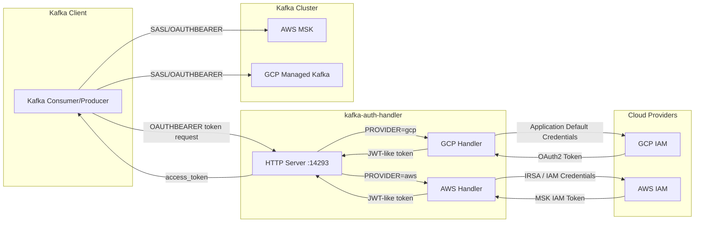

[](https://goreportcard.com/report/github.com/martoc/kafka-auth-handler)

[](https://opensource.org/licenses/MIT)

# kafka-auth-handler

A lightweight HTTP server that provides OAuth2 tokens for Kafka clients authenticating against Google Cloud Platform (GCP) or Amazon Web Services (AWS).

## Overview

This handler provides Kafka-compatible OAuth2 tokens for both GCP Managed Kafka and AWS MSK. It runs as a sidecar or local service, listening on port 14293 and returning JWT-formatted access tokens.

## Architecture



### Supported Providers

| Provider | Authentication Method | Credential Source |
|----------|----------------------|-------------------|
| `gcp` | GCP OAuth Bearer | `GOOGLE_APPLICATION_CREDENTIALS` or Workload Identity |
| `aws` | AWS MSK IAM | IRSA (IAM Roles for Service Accounts) or AWS credentials |

## Quick Start

### GCP (Default)

```bash
# Build
make build

# Run the server (defaults to GCP)
./target/builds/kafka-auth-handler-darwin-arm64 serve
```

### AWS

```bash
# Set environment variables
export PROVIDER=aws
export REGION=eu-central-1

# Run the server
./target/builds/kafka-auth-handler-darwin-arm64 serve
```

## Environment Variables

| Variable | Required | Default | Description |
|----------|----------|---------|-------------|
| `PROVIDER` | No | `gcp` | Cloud provider: `gcp` or `aws` |
| `REGION` | Yes (AWS) | - | AWS region for MSK IAM token generation |

## Docker

```bash
# GCP
docker pull martoc/kafka-auth-handler:latest
docker run -p 14293:14293 martoc/kafka-auth-handler:latest

# AWS
docker run -p 14293:14293 \
  -e PROVIDER=aws \
  -e REGION=eu-central-1 \
  martoc/kafka-auth-handler:latest
```

## Library Usage

This package can be imported as a library in your Go applications:

```go
import "github.com/martoc/kafka-auth-handler/handler"

// Create a handler based on provider
provider := os.Getenv("PROVIDER")
region := os.Getenv("REGION")
authHandler := handler.NewAuthHandler(provider, region)

// Use with your HTTP server
http.Handle("/token", authHandler)
```

### Provider-Specific Handlers

```go
// GCP handler
gcpHandler := handler.NewGCPAuthHandlerBuilder().Build()

// AWS handler
awsHandler := handler.NewAWSAuthHandlerBuilder().
    WithRegion("eu-central-1").
    Build()
```

## AWS MSK Configuration

When using AWS MSK with IAM authentication:

1. Use port **9098** for IAM authentication on your MSK bootstrap servers
2. Set `KAFKA_SECURITY_PROTOCOL=SASL_SSL`
3. Set `KAFKA_SASL_MECHANISM=OAUTHBEARER`
4. Ensure your pod/service has proper IAM permissions (via IRSA on EKS)

## Documentation

- [Usage Guide](./docs/USAGE.md)
- [Code Style](./docs/CODESTYLE.md)
- [Claude Code Guide](./CLAUDE.md)

## Migration from gcp-kafka-auth-handler

If you're migrating from the GCP-only version:

1. Update your import path from `github.com/martoc/gcp-kafka-auth-handler` to `github.com/martoc/kafka-auth-handler`
2. The default behaviour (GCP) remains unchanged - no code changes needed for existing GCP deployments
3. Legacy type aliases (`AuthHandler`, `NewAuthHandlerBuilder`) are provided for backwards compatibility
